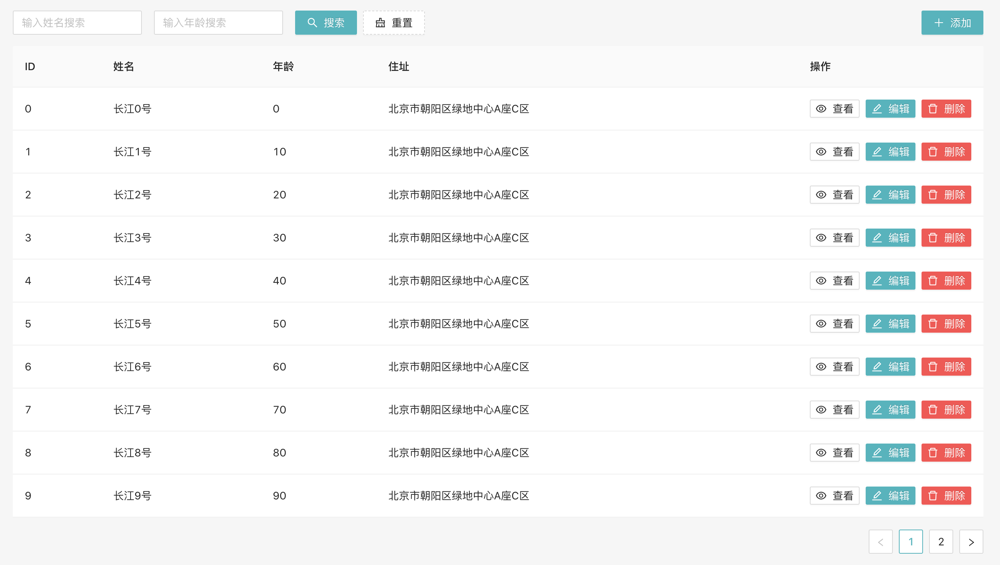

# react-hook-antd-reducer-crud

#### Description

Friendly CURD template build with React Hook + Ant Design, state container use useReducer + useContext

React Hook + Antd CURD 模板最佳实践，使用 useReducer + useContext 打造页面级别的Redux状态管理。

#### Dependence

- react: >= 16.8.1
- antd: >= 4.0
- redux-actions: >= 2.0.0

Install dependence:

```js
npm i react antd redux-actions -S
```

#### Screenshoot

